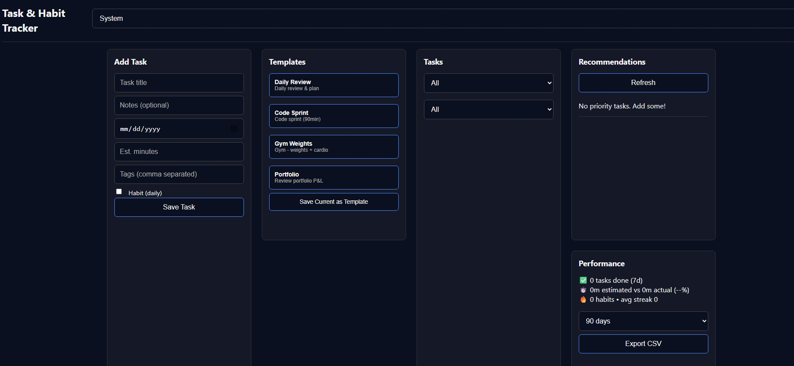
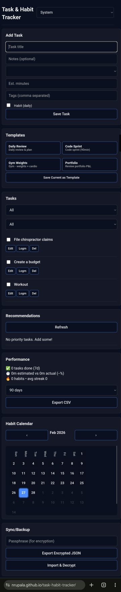
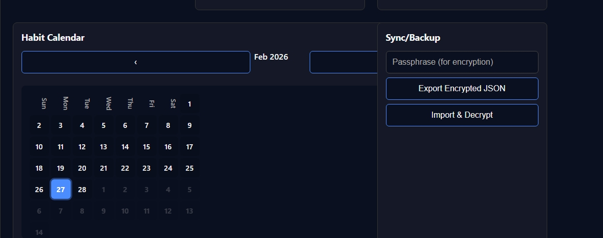

# task-habit-tracker
Standalone localized task and habit tracker, with encrypted backup and import options.
Generates an encrypted JSON using pass-phrase to save and send. So, asynchronous concurrent updating can be done across devices without others of snooping.
# Task & Habit Tracker 🚀

> **Single-file productivity app** - Tasks + Habits + Analytics + Sync. Zero setup. Works offline.

## ✨ **Features**

| Feature | Description |
|---------|-------------|
| **Task Management** | Add/edit/delete tasks with due dates, time estimates |
| **Habit Tracking** | Daily streaks + beautiful heatmap calendar |
| **Smart Recs** | Priority scoring (habits > overdue > quick wins) |
| **Performance** | 7/30/90d reports + CSV export for Excel analysis |
| **Templates** | Preloaded + custom (Daily Review, Gym, Code Sprint) |
| **Encrypted Sync** | AES-GCM backup for Google Drive/OneDrive |
| **Themes** | Dark/Light/System with perfect contrast |
| **Mobile** | Responsive + iOS/Android home screen install |

## 🎮 **Quick Start**

1. **Save** `index.html` → double-click
2. **Add task** → "Daily review" → Save
3. **Mark complete** → Watch calendar + streaks
4. **Export CSV** → Analyze in Excel

**Live**: https://nrupala.github.io/task-habit-tracker

## 📱 **Mobile Install**
Safari/Chrome → Share → "Add to Home Screen" If browser gives option to run as Web-app/App select yes. And a Native App Icon appears.
→ Native app icon (localStorage per device)

## 🔄 **Sync Between Devices**
Device 1: Export Encrypted → Google Drive
Device 2: Download → Import & Decrypt (same passphrase)

## 🛠 **Preloaded Templates** You can edit these in code to be different from what is loaded. 
Daily Review (15m, habit)
Code Sprint (90m)
Gym Weights (60m, habit)
Portfolio Review (20m)

## 📊 **CSV Export Format**
Date,Task,Status,Est,Actual,Tags,Habit,Streak,Notes
2026-02-26,"Daily review",done,15,12,"review;planning",YES,3,"Wins/misses"
## 🎨 **Screenshots**

## 🚀 **Deployment Options**

| Platform | Steps | URL |
|----------|-------|-----|
| **GitHub Pages** | Upload `index.html` → Settings → Pages → main | `username.github.io/repo` |
| **Netlify** | Drag file to netlify.com/drop | Instant URL |
| **Local** | Double-click `index.html` | Works offline |

## 📖 **Full Documentation**
- [User Guide](docs/usage.md) 
- [Data Format](docs/api.md)  

## 🔧 **Customization**
Edit index.html → Ctrl+F "BUILTIN_TEMPLATES" → Add your own

